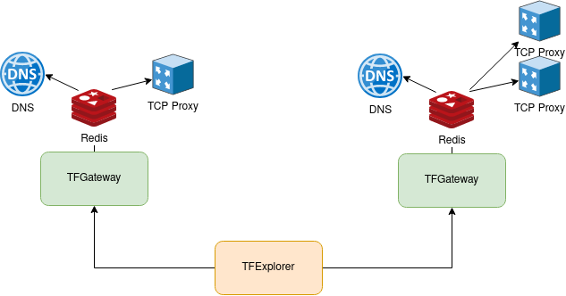

# TFGateway 

## Supported primitives

- Delegation of domain
- Creation of A or AAAA DNS records
- HTTP(S) proxy
- Reverse tunnel TCP proxy: https://github.com/threefoldtech/tcprouter#reverse-tunneling
- Gateway IPv4 to IPv6

## Deployment



The TFGateway works be reading the reservation detail from the TFExplorer. It then convert these reservation into configuration readable by the TCP Router server or CoreDNS and write them into a redis server.

Both CoreDNS and the TCP router are watching redis and reloads there internal configuration evrytime there is a change in redis.

### Delegation of domain

If you want people to be able to delegate domain to the TFGateway. User needs to create a `NS record` pointing to the a domain of the TFGateway. Which means you need to have an `A record` pointing to the IP of the TFGateway and use the `--nameservers` flag when starting the TFGateway.

### TCP Router server example configuration

```toml
[server]
addr = "0.0.0.0"
port = 443
httpport = 80
clientsport = 18000
[server.dbbackend]
type 	 = "redis"
addr     = "127.0.0.1"
port     = 6379
refresh  = 10
```

### CoreDNS example configuration


```
. {
    redis  {
        address 127.0.0.1:6379
    }
}
```

### Gateway 4 to 6 prerequisite

- The host needs to masquerade the ipv6 traffic going out `ip6tables -t nat -A POSTROUTING -o eth0 -j MASQUERADE`
